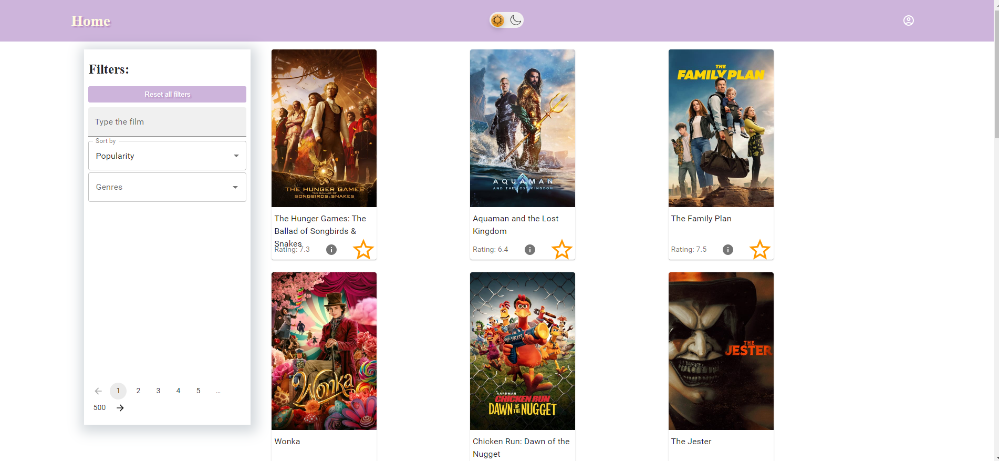
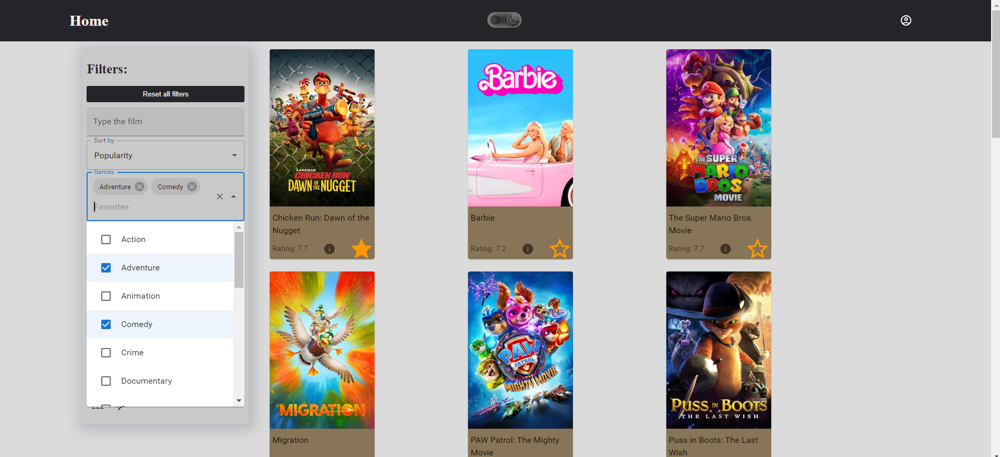
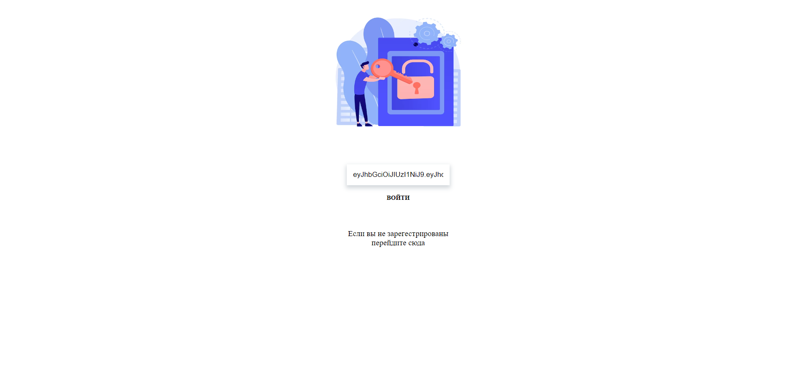
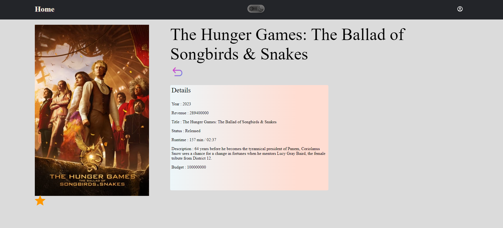

# MovieApp

Movie App

This app is used for searching movies based on the query and filters.

It uses the following API: <a href='https://developer.themoviedb.org/reference/intro/getting-started'>Movie DB</a>

Main features:

This application consists of three main pages:

    1. Registration and login pages. You can register via your email and afterwards you will get a token onto your mail. Or in case having token you just can login.

    2. Main page, consisting of filters block and list of searched films. Each films contains two buttons with info and favourite button.

    3. Info page. This page depicts the exact movie, its description and additional info.

Main Technologies:

    -React
    -JS
    -MUI
    -Redux

This API works only with VPN :(
